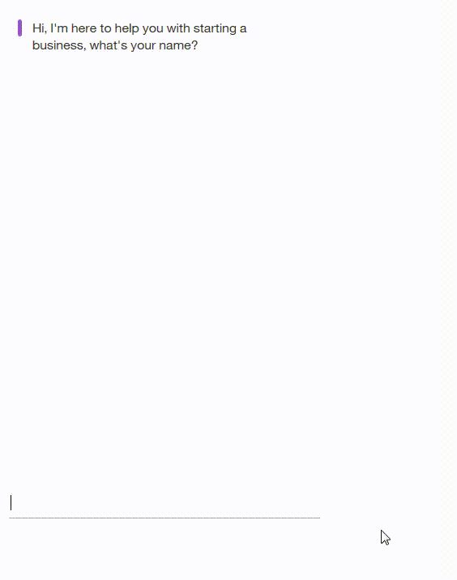

<h1 align="center" style="border-bottom: none;">Legal advice for business startups (LABS)</h1>

LABS is a online chatbot service that helps startups find the resources that they need to navigate the complex world of starting a business. The chatbot uses the [IBM Watson-Assistant](https://www.ibm.com/watson/ai-assistant/) engine to create a flexible interface which users can interact with more naturally.

The image below shows the IBM Watson Assistant interface where we contructed the intents, entities, and dialogs that form the rules that the chatbot uses.


The image below shows the running chatbot, you can view the [demo](http://103.197.63.199/) online:



## Source

The personal assistant web frontend was forked from an existing [Watson Assignment sample](https://github.com/watson-developer-cloud/assistant-simple)

## Running locally

1. Install the dependencies

    ```
    npm install
    ```

1. Run the application

    ```
    npm start
    ```

1. View the application in a browser at `localhost:3000`
